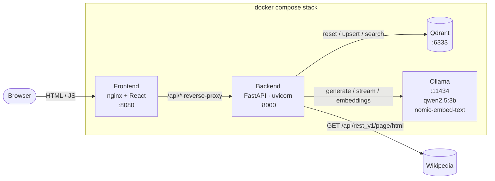
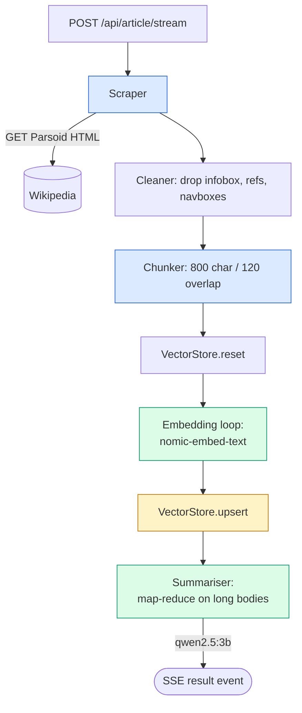
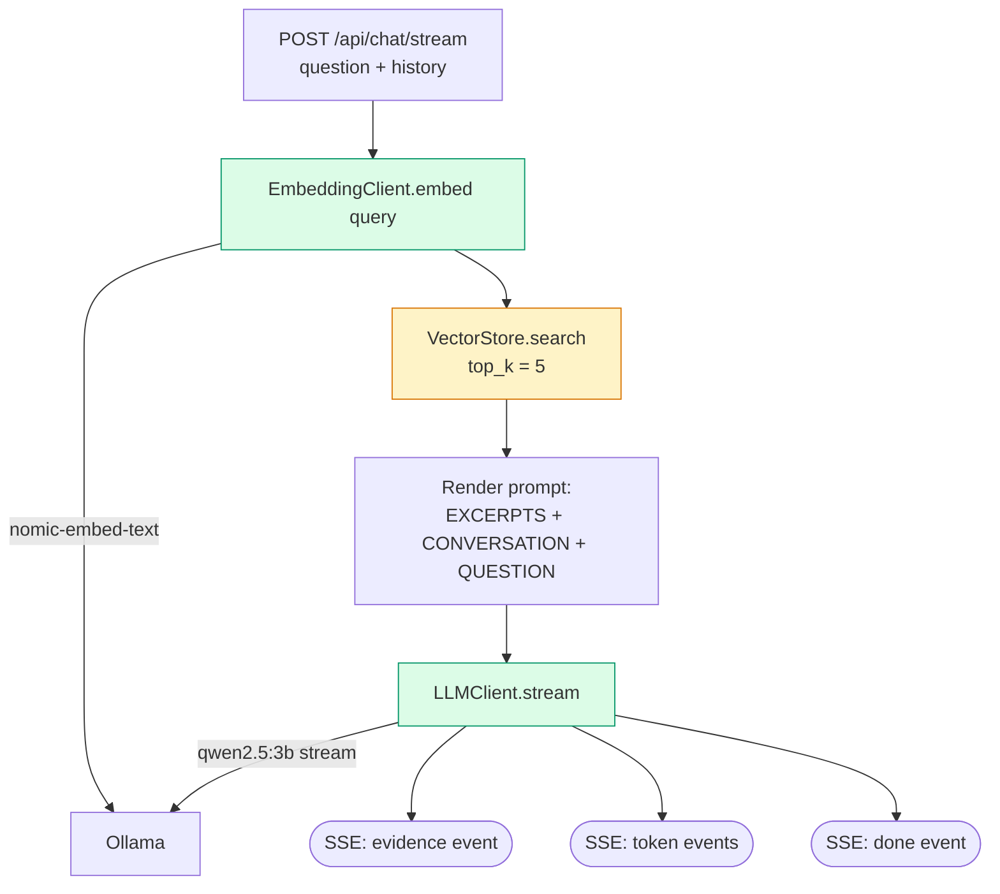

# Design

## 1. Goals (recap)

A single-page web app that, given a Wikipedia URL, scrapes the article, produces a summary with a local LLM, indexes the article into a vector store, and lets the user chat with the article via retrieval-augmented generation grounded only in retrieved chunks. Single `docker compose up` brings the whole stack up. No hosted inference at runtime. ≥85% backend line coverage. The full functional contract is in [REQUIREMENTS.md](REQUIREMENTS.md).

This document covers the **how**: components, contracts, data flow, the chunking and retrieval numbers, error handling, prompts, containerisation, and the trade-offs behind every non-obvious choice.

## 2. Architecture overview

Four services, one shared Docker network, one user-facing port.



**Why this shape.** The backend owns all orchestration. The frontend is a thin shell that posts to a few endpoints. The vector store and the LLM runtime are sidecars accessed only by the backend. Frontend → backend → infra is a one-way dependency tree, which keeps the testing story simple (the backend can be tested in isolation against fakes).

### Indexing flow (`POST /api/article/stream`)



### Chat flow (`POST /api/chat/stream`)



## 3. Stack choices and the alternatives

| Choice | Picked | Alternatives considered | Why this one |
| --- | --- | --- | --- |
| Backend framework | **FastAPI** | Django, Flask, Starlette | FastAPI gives async I/O (needed because the LLM and vector calls are network-bound), Pydantic for boundary validation, and zero-config OpenAPI docs which double as a smoke-test surface. Django is overkill — we have no ORM, no admin, no auth. Flask lacks native Pydantic and async. |
| Frontend | **React + Vite, plain CSS** | Next.js, SvelteKit, HTMX, server-rendered HTML | The brief says aesthetics are not graded. Vite gives a fast dev loop and a tiny prod bundle; React keeps the chat-box state model trivial; plain CSS avoids dragging in Tailwind/component-library weight for one screen. Next.js's SSR story is wasted here because there is nothing to SSR — every interesting bit happens after the user pastes a URL. HTMX would also work but the user is more productive in React. |
| LLM runtime | **Ollama** | vLLM, llama.cpp directly, LM Studio | Ollama is the easiest to containerise and pulls models declaratively (`ollama pull qwen2.5:3b`). It exposes a stable HTTP API. vLLM is GPU-first and painful to set up CPU-only. llama.cpp is more efficient but requires us to ship our own server. Ollama also handles both chat and embedding models in one process, which removes a service. |
| Chat/summary model | **`qwen2.5:3b`** (3B params, **32 K-token context**, Q4 quantised, ~2.0 GB) | `phi3:mini` (4 K context), `llama3.2:3b` (similar specs), 7B-class models | Brief explicitly accepts 3 B-class models for laptop-grade hardware. The 32 K context is the load-bearing decision: it fits a single Wikipedia article body in one summariser call without truncation for most cases, and supports a 5-call map-reduce that covers up to 48 K chars for long articles. 4 K-context models force aggressive truncation; 7 B models give better refusal behaviour but exceed the 16 GB RAM budget under load. See §3.1 for the journey to this choice. |
| Embedding model | **`nomic-embed-text`** (137M params, 768-dim, served by Ollama) | `all-MiniLM-L6-v2` (384-dim), OpenAI `text-embedding-3-small` | Same Ollama process means no extra service, no extra image, no extra network hop. `nomic-embed-text` benchmarks at or above all-MiniLM on retrieval tasks while still being CPU-fast. OpenAI embeddings are off the table per the local-only constraint. |
| Vector store | **Qdrant** | Chroma, pgvector, FAISS, Weaviate, Milvus | Qdrant runs as a single container with a clean REST API, has a stable Python client, supports HNSW, and persists to a named volume. Chroma is also fine but its server mode is newer and slightly less robust under writes. pgvector drags in Postgres for one table. FAISS is in-process only — running it as a sidecar would be artificial and fragile. Milvus is overkill. |
| Chunker | **Recursive character splitter** with paragraph → sentence → word → char fallback | Token-based splitter, sentence-only, semantic chunking | Recursive char splitter is robust on Wikipedia (which has clean paragraph structure) and predictable in size. Token-based splitting requires a tokenizer for the embedding model and adds a dependency for marginal benefit. Semantic chunking adds latency and embedding calls during ingestion for unclear gain on a single article. |
| Frontend ↔ backend | **JSON `/article` + `/chat` plus an SSE `/article/stream`** | WebSockets, GraphQL | The plain JSON routes are the testable contract (`curl`-friendly, `TestClient`-friendly). The streaming variant pipes per-phase progress events to the browser so the long ingestion shows live status; both routes share one underlying pipeline so logic stays in one place. WebSockets are overkill for a one-way progress feed. |
| Containerisation | **One `docker-compose.yml`, four services, healthchecks gate startup** | Kubernetes manifests, Docker Swarm, single megacontainer | The brief asks for a single command on a clean machine. Compose is the canonical answer. Healthchecks force the backend to wait for Ollama and Qdrant before serving — see §10. |

### 3.1 Model selection: from `phi3:mini` to `qwen2.5:3b`

The first cut of this design picked **`phi3:mini`** as the chat/summary model. It is Microsoft's reasoning-tuned 3 B model, well-regarded for following short instructions like "answer only from these excerpts" — exactly the behaviour the FR-14 grounding contract depends on. It met the brief's constraints (3 B class, runs on a laptop, ~2.3 GB quantised) and was named in the brief's own examples.

Real-world testing on actual Wikipedia articles surfaced the problem: **`phi3:mini` has a 4 K-token context window (~16 K chars). Most Wikipedia articles overflow that 5×.** The first integration test with the *Albert Einstein* article (86 K chars body) timed out repeatedly: the summary path was sending the full body and the model couldn't process 21 K tokens of input on CPU within any reasonable timeout. Naive truncation to 4 K chars produced a "summary of the lead section" only — technically correct but a degraded experience.

We migrated to **`qwen2.5:3b`** (Alibaba's 3 B model, 32 K-token context, also Q4-quantised, ~2.0 GB on disk) for two reasons:

1. **Context budget.** 32 K tokens is 8× phi3's window. Most Wikipedia articles fit in one summariser call without any truncation; longer ones now run a 4-segment map-reduce that covers up to ~48 K chars instead of just 4 K.
2. **Same hardware envelope.** Qwen 2.5 3B is in the same RAM and disk class as phi3:mini. No infrastructure changes needed.

The cost was a small refusal-behaviour regression on tangential questions — `phi3:mini` was slightly more disciplined about "I cannot find that in the article" on partial-match retrievals. The FR-14 worst-case test (totally unrelated chunks) still passes; the partial-match drift is documented in §13. NOTES.md captures the migration as the most material AI-vs-human correction in the build: the agent's first design did not check the model context budget against typical Wikipedia article lengths, and we caught it during execution rather than in review.

## 4. Components

Backend Python package layout (illustrative — names may shift slightly during scaffolding):

```
backend/
├── app/
│   ├── main.py              # FastAPI app instantiation, DI wiring  (excluded from coverage)
│   ├── api/
│   │   ├── routes_article.py
│   │   └── routes_chat.py
│   ├── schemas.py           # Pydantic request/response models       (excluded from coverage)
│   ├── deps.py              # DI providers                           (excluded from coverage)
│   ├── core/
│   │   ├── interfaces.py    # LLMClient / EmbeddingClient / VectorStore protocols
│   │   ├── scraper.py       # Wikipedia URL → article text
│   │   ├── chunker.py       # text → chunks
│   │   ├── summariser.py    # article text → summary string (uses LLMClient)
│   │   ├── rag.py           # question → answer + evidence (uses Embedding/VectorStore/LLMClient)
│   │   └── errors.py        # typed exceptions
│   └── adapters/
│       ├── ollama_llm.py
│       ├── ollama_embedding.py
│       └── qdrant_store.py
└── tests/
    ├── unit/
    └── integration/
```

Each component has one job:

- **Scraper.** Resolves Wikipedia URLs (canonical + mobile + redirect) to article body text. Detects and rejects disambiguation pages. Strips navigation chrome, infoboxes, references list, image captions, and citation footnotes. Returns plain text plus the resolved canonical title.
- **Chunker.** Pure function: `(str) → list[Chunk]`. Recursive character splitter with paragraph → sentence → word fallbacks. Configurable but defaulted to the locked numbers (§6). No external calls; trivially unit-testable.
- **EmbeddingClient.** Adapter over Ollama's `/api/embeddings` endpoint for `nomic-embed-text`. Used by both the indexing path and the chat path.
- **VectorStore.** Adapter over Qdrant. Owns one collection. Upsert and search are the only operations the rest of the app needs.
- **LLMClient.** Adapter over Ollama's `/api/generate` endpoint for `qwen2.5:3b`. Single `generate(system, user)` method.
- **Summariser.** Composes `LLMClient.generate` with the summary system prompt (§7). Does not know it is talking to Ollama.
- **RAG pipeline.** Composes `EmbeddingClient.embed` → `VectorStore.search` → `LLMClient.generate` with the RAG prompt (§7). Returns answer text plus the chunks used as evidence.
- **API routes.** Thin: validate input via Pydantic, call into a use-case function, map typed exceptions to HTTP responses. No business logic in route handlers.

## 5. Module contracts

Three Python `Protocol` interfaces. Business logic depends on these; concrete adapters live in `app/adapters/` and are wired in `deps.py`. Swapping Ollama for vLLM means writing one new file under `adapters/`. Swapping Qdrant for Chroma means the same.

```python
# app/core/interfaces.py

from typing import Protocol, runtime_checkable
from dataclasses import dataclass

@dataclass(frozen=True, slots=True)
class Chunk:
    id: str            # stable hash of (article_title, chunk_index)
    text: str
    chunk_index: int
    article_title: str

@dataclass(frozen=True, slots=True)
class RetrievedChunk:
    chunk: Chunk
    score: float

@runtime_checkable
class LLMClient(Protocol):
    async def generate(self, *, system: str, user: str, max_tokens: int = 512) -> str: ...
    def stream(self, *, system: str, user: str, max_tokens: int = 512) -> AsyncIterator[str]: ...

@runtime_checkable
class EmbeddingClient(Protocol):
    async def embed(self, texts: list[str]) -> list[list[float]]: ...

@runtime_checkable
class VectorStore(Protocol):
    async def reset(self) -> None: ...                                  # clears the collection
    async def upsert(self, chunks: list[Chunk], vectors: list[list[float]]) -> None: ...
    async def search(self, query_vector: list[float], k: int) -> list[RetrievedChunk]: ...
```

Three design notes on the contracts:

1. **`LLMClient` and `EmbeddingClient` are separate** even though both are Ollama-served today. Conceptually they are different operations and they may well be served by different runtimes in the future (e.g. chat on vLLM, embeddings on a sentence-transformers service). Splitting them costs nothing now and earns the swap headroom the brief asks for.
2. **`VectorStore.reset()`** is intentionally on the interface. The "one article at a time, new URL replaces old" requirement (FR-10) is part of the contract, not an implementation detail; making `reset` explicit forces every adapter to implement it consistently.
3. **All methods are async.** Route handlers are FastAPI-async, the underlying clients (`httpx`, `qdrant-client`) are async, and the indexing pipeline is an async generator that yields progress events. Making the protocols async keeps adapters and use-cases idiomatic and avoids `asyncio.to_thread` wrapping at every call site.

## 6. Data flow walkthrough

### Indexing path — `POST /article` and `POST /article/stream`

Both routes consume the same async generator (`_index_pipeline`). The JSON variant collects the final result; the streaming variant emits one Server-Sent Event per phase. Pipeline steps:

1. Pydantic validates the URL (`en.wikipedia.org` or `en.m.wikipedia.org`). Failure → HTTP 400.
2. **Scrape.** `Scraper.fetch(url)` GETs the Wikipedia REST API (`https://en.wikipedia.org/api/rest_v1/page/html/{title}`) with a polite User-Agent. Parsoid HTML is significantly cleaner than the rendered page HTML and stable across Wikipedia template changes. BeautifulSoup drops the disallow-list (infobox, references, navboxes, captions, footnotes); the result is paragraph + heading text. Disambiguation pages (detected via `<link rel="mw:PageProp/disambiguation">`) and bodies < 200 chars are rejected with typed errors.
3. **Chunk.** `chunk_article(body)` produces ~30–80 chunks for a typical Wikipedia article (800-char chunks with 120-char overlap).
4. **Reset.** `VectorStore.reset()` clears the previous article's vectors.
5. **Embed + upsert.** Sequential per chunk (Ollama's embedding endpoint isn't batchable today). Each chunk yields a 768-dim vector; all are upserted into Qdrant.
6. **Summarise.** `Summariser.summarise(body)` runs *after* embedding completes — sequential, not parallel. Two reasons: it keeps only one model hot in Ollama at a time (which matters on a 16 GB CPU box), and it gives the UI clean, ordered progress events. For long articles the summariser internally runs map-reduce (§7).
7. Final event: `{"title": "...", "summary": "...", "chunk_count": N}`.

### Chat path — `POST /chat` and `POST /chat/stream`

Both routes share retrieval and prompt assembly:

1. Pydantic validates a non-empty `question` (≤ 2000 chars) and an optional `history` array (≤ 20 turns of `{role: "user" | "assistant", text}`).
2. `EmbeddingClient.embed([question])` produces one 768-dim query vector.
3. `VectorStore.search(query_vector, k=5)` returns the top 5 chunks by cosine similarity.
4. The chat prompt (§7) is rendered with the numbered excerpts, the prior conversation (if any), and the new question.

Then they diverge:

- **`/chat` (JSON):** `LLMClient.generate` returns the full answer; the route returns `{"answer": "...", "evidence": [...]}`. Used by direct API clients and tests.
- **`/chat/stream` (SSE):** the route opens a Server-Sent Events stream, emits one `evidence` event up front, then `LLMClient.stream` yields tokens as Ollama generates them and each surfaces as a `token` event, terminating with a `done` event. The frontend appends each token to the assistant bubble live, with a blinking cursor indicating "still generating".

The frontend keeps the message log in component state and includes the last 6 turns as `history` on each chat request, so the model can interpret follow-ups like *"tell me more"* and meta-questions like *"what did I just ask?"*.

## 7. Prompts

Two prompts. Pinned in code. No prompt templating library — these are short enough that an f-string is clearer than a framework.

### Summary

`qwen2.5:3b` has a 32K-token context window (~128K chars), but CPU prefill cost still scales with input size, so we cap each summary call's input at 12K chars (~3K tokens). For articles longer than that we run **map-reduce**:

```
1. Split body into up to 4 segments of <= 4000 chars each (paragraph-aware cuts).
2. MAP — one brief partial summary per segment:
       SYSTEM: You are summarising one part of a longer Wikipedia article.
               In 2 to 3 sentences, capture the key facts from THIS SEGMENT
               only. Use only information present in the segment. Do not invent.
       USER:   ARTICLE TITLE: {title}
               SEGMENT:
               {segment}
3. REDUCE — combine the partials into one coherent summary:
       SYSTEM: You are combining several partial summaries of one Wikipedia
               article into a single coherent summary. Merge them into 5 to 8
               sentences that read as one summary, removing redundancy and
               contradictions. Use only information from the partial summaries.
       USER:   ARTICLE TITLE: {title}
               PART 1: {partial_1}
               PART 2: {partial_2}
               ...
```

For short articles (body fits in one segment) we skip map-reduce and use the original single-call prompt:

```
SYSTEM:
You are a precise summariser. Summarise the Wikipedia article below in 5 to 8
sentences. Use only information from the article. Do not include facts you may
know from elsewhere. Do not invent details. Output only the summary, no
preamble, no headings.
```

**Latency vs. coverage.** A long article (> 12 K chars) costs `N+1` LLM calls (up to 4 partials + 1 reduce). On `qwen2.5:3b`-CPU each call is ~30–60 s with the model resident (we send `keep_alive: 30m` so it isn't reloaded between calls), so a worst-case summary takes 3–5 min. We accept this for coverage: the summary now considers up to 48 K chars of the article (4 segments × 12 K), enough to cover the great majority of Wikipedia articles in full. Anything past 48 K chars is dropped — see §13. The chat path is unaffected: it sees the full article through retrieval (top-k=5 over the whole body's chunks).

### Chat (RAG)

```
SYSTEM:
You are a careful research assistant for a single Wikipedia article. The
numbered EXCERPTS below are the only allowed source of facts about the
article. If a question asks for article information that the excerpts do
not contain, reply exactly: "I cannot find that in the article." The
CONVERSATION SO FAR (if any) records what the user and you have already
discussed in this session: use it to interpret follow-up questions like
"tell me more", and to answer questions about the conversation itself
(such as "what did I ask?"). Never use prior knowledge about the article
topic. Do not speculate. Keep answers to 1 to 4 sentences.

USER:
EXCERPTS:
[1] {chunk_1_text}
[2] {chunk_2_text}
...

CONVERSATION SO FAR:        # only when history is present
You: {prev_question}
Assistant: {prev_answer}
...

QUESTION: {question}
```

The exact phrase `"I cannot find that in the article."` is the verifiable refusal contract. The no-evidence-refusal test (FR-14) asserts this string surfaces in the pipeline output when retrieval is fed unrelated content.

**Two grounding rules in one prompt.** Article-fact questions are gated on the EXCERPTS only; meta-questions about the conversation are answered from CONVERSATION SO FAR. The split lets multi-turn chats work (*"tell me more about that"*, *"what did I ask?"*) without leaking prior knowledge about the article topic.

**Why a string match over a similarity-threshold gate.** I considered gating on `max(similarity) < 0.4 → return refusal directly, skip the LLM`. I rejected it: cosine thresholds for `nomic-embed-text` vary by topic and would need empirical tuning, and a hard gate skips the case where the chunks are tangentially related but not actually answering the question. Letting the model itself refuse is more robust and tests as a behavioural property of the pipeline rather than a magic number.

## 8. Chunking strategy (locked numbers)

| Knob | Value | Reasoning |
| --- | --- | --- |
| Chunk size | **800 characters** | ~200 tokens (roughly 4 chars/token in English). Top-5 retrieval = ~1000 tokens of context. With a ~150-token system prompt, ~50-token question, ~150-token answer budget, total context use is ~1350 tokens — well within `qwen2.5:3b`'s 32K window. |
| Chunk overlap | **120 characters** | 15% of chunk size. Prevents a sentence that crosses a chunk boundary from being orphaned in either neighbour. Standard RAG default; no tuning required. |
| Splitter | **Recursive character** with separator priority `["\n\n", "\n", ". ", " ", ""]` | Prefer paragraph breaks; fall back to sentence end, then word, then character. Keeps semantically coherent units together when possible. |
| Minimum article body | **200 characters** | Anything shorter is a stub; chatting with it is meaningless. Rejected with a 422 before any LLM/vector call. |

These numbers are pinned in `core/chunker.py` as module-level constants and exposed via env vars in `.env.example` for operators who want to tune them, but the defaults are not knobs we expect to turn during the build.

## 9. Retrieval strategy (locked numbers)

| Knob | Value | Reasoning |
| --- | --- | --- |
| Top-k | **5** | Five chunks of ~200 tokens fit comfortably in the prompt window and cover most question topics on a Wikipedia article. Going higher dilutes signal and burns context budget. |
| Distance metric | **Cosine** | Standard for sentence-transformers-style models including `nomic-embed-text`. Qdrant's default. |
| Rerank | **None for v1** | A cross-encoder reranker would improve precision but requires a second model and another network hop. Not warranted at this scope. Listed in NOTES.md as a "with another two days" addition. |
| Refusal mechanism | **Prompt-level, model-driven** (no similarity threshold) | See §7 reasoning. |

## 10. Error handling

Each error case has a typed exception and a single point of mapping to HTTP status. No naked `except Exception:` blocks.

| Case | Exception | HTTP | User-facing message |
| --- | --- | --- | --- |
| URL doesn't parse / wrong domain | `InvalidUrlError` (raised in Pydantic validator) | 400 | "Please paste a Wikipedia article URL (en.wikipedia.org)." |
| Wikipedia 404 | `ArticleNotFoundError` | 404 | "We couldn't find that Wikipedia article." |
| Wikipedia network failure / 5xx | `WikipediaUnreachableError` | 502 | "Couldn't reach Wikipedia. Try again in a moment." |
| Disambiguation page | `DisambiguationError` | 422 | "That URL is a disambiguation page. Pick a specific article and try again." |
| Article body too short | `ThinArticleError` | 422 | "That article is too short to be useful for chat." |
| Ollama unreachable | `LLMUnavailableError` | 503 | "The local model is not ready yet. Try again in a few seconds." |
| Qdrant unreachable | `VectorStoreUnavailableError` | 503 | "The vector store is not ready yet. Try again in a few seconds." |

Backend startup waits for Ollama and Qdrant healthchecks (Compose `depends_on: condition: service_healthy`) so the 503 paths are corner cases rather than the common-case startup experience.

The no-evidence-refusal case (FR-14) is **not** an error — it is a successful chat response whose answer happens to be the refusal phrase. The evidence array still carries the retrieved chunks so the user can see what was searched.

## 11. Containerisation

Four services in `docker-compose.yml`:

| Service | Image | Notable details |
| --- | --- | --- |
| `ollama` | `ollama/ollama:latest` | Named volume for model storage. Entrypoint script pulls `qwen2.5:3b` and `nomic-embed-text` on first start and then `exec`s `ollama serve`. Healthcheck hits `/api/tags` and asserts both models are listed. |
| `qdrant` | `qdrant/qdrant:latest` | Named volume for storage. Healthcheck hits `/readyz`. |
| `backend` | Built from `backend/Dockerfile` (multi-stage, slim base) | Depends on `ollama` and `qdrant` being healthy. Runs `uvicorn` on port 8000. |
| `frontend` | Built from `frontend/Dockerfile` (multi-stage: Node build → nginx serve) | nginx serves the built bundle and proxies `/api/*` to the backend. Single user-facing port 8080. |

`.env.example` documents `OLLAMA_HOST`, `QDRANT_HOST`, `CHAT_MODEL`, `EMBED_MODEL`, `CHUNK_SIZE`, `CHUNK_OVERLAP`, `TOP_K`. Real `.env` is git-ignored.

**One known caveat.** The first `docker compose up` on a clean machine downloads ~2.6 GB of model weights via the Ollama entrypoint. This is unavoidable for a local-LLM stack and is documented in README.md.

## 12. Testing approach

| Layer | Coverage strategy |
| --- | --- |
| Scraper | Unit tests against committed Wikipedia HTML fixtures (canonical article, redirect, disambiguation, stub). No live network. |
| Chunker | Pure-function unit tests: known input → expected chunks. Edge cases: empty string, single-paragraph, exact-boundary string. |
| Summariser, RAG pipeline | Unit tests with `LLMClient` / `EmbeddingClient` / `VectorStore` replaced by `Protocol`-conforming fakes. Pipeline tests assert prompt structure and that the no-evidence path returns the refusal string. |
| Adapters (`ollama_llm`, `ollama_embedding`, `qdrant_store`) | Unit-tested with `httpx.MockTransport` / Qdrant client mocked. The thin adapter layer is what mocking targets. |
| API routes | `httpx.AsyncClient` against the FastAPI app with the three interfaces overridden by fakes via FastAPI's `dependency_overrides`. |
| Integration | One test that spins up the real compose stack (`docker compose up -d ollama qdrant`), pulls a small fixture article, and asserts the full URL → summary → chat flow. Marked `@pytest.mark.integration` and skipped in the default unit run. |

Coverage exclusions, declared in `pyproject.toml`. The brief permits three categories ("generated boilerplate, framework glue, and the entrypoint file"); each line below maps to one of them and nothing else is excluded:

```toml
[tool.coverage.run]
omit = [
  "app/main.py",      # entrypoint file
  "app/schemas.py",   # generated boilerplate (pure Pydantic data classes, no behaviour)
  "app/deps.py",      # framework glue (FastAPI dependency-injection providers)
]
```

If the reviewer challenges any exclusion, the line comes back into coverage; the targeted module already has tests at the route layer that exercise it, so re-inclusion does not threaten the 85% bar.

## 13. Honest limitations

- **3B-class instruction-following on refusal.** `qwen2.5:3b` occasionally drifts into prior-knowledge answers despite a strict system prompt, particularly when the chunks contain *partial* information. The FR-14 test pins the worst case (totally unrelated chunks) but does not eliminate the failure mode entirely. NOTES.md captures the honest record.
- **Map-reduce summary cap.** Articles beyond ~48 K chars (4 segments × 12 K) get the first 48 K covered and the tail dropped. Chat retrieval still indexes the full article, so the chat path is unaffected — only the summary panel shows partial coverage on very long articles.
- **CPU cold start.** First inference after stack startup can take 30–60 seconds while the model loads from disk into memory. Healthchecks gate the backend on Ollama readiness; first user request then warms the model. Subsequent requests are fast.
- **Wikipedia REST API stability.** Wikipedia occasionally rate-limits unauthenticated GETs. We send a polite User-Agent and document the failure mode. We do not implement retry-with-backoff; the user can simply resubmit.
- **Single-user assumption.** The vector store is a single shared collection. Concurrent indexing of two different articles by two users would race. Out of scope for the brief but worth flagging.
