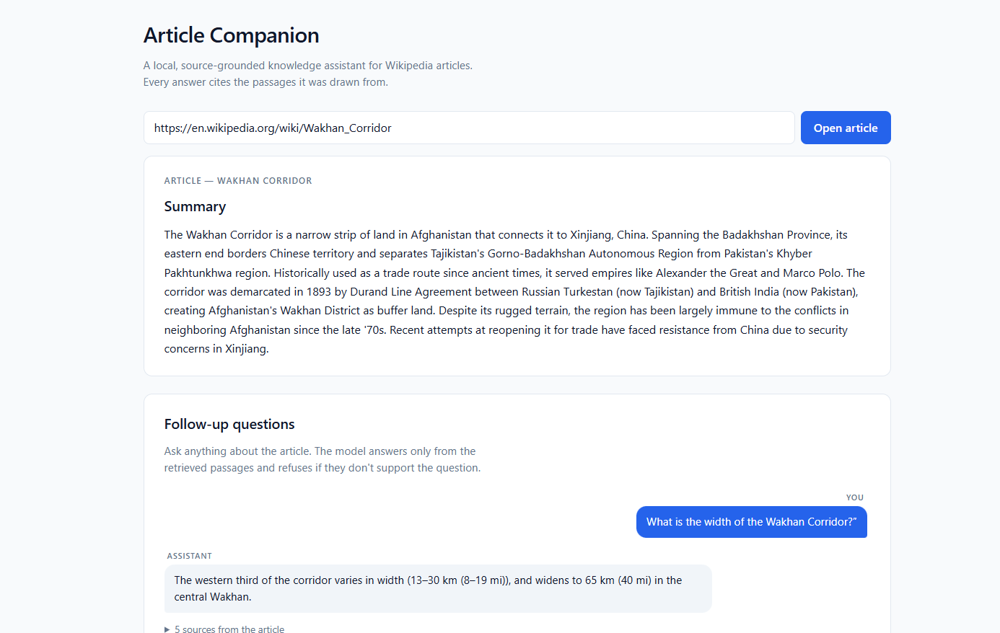

# Wikipedia RAG Chat

A small, containerised RAG chat application over a single Wikipedia article. Paste a URL, get a streaming summary, then ask follow-up questions. Every answer is grounded in retrieved passages from the article — the model is instructed to refuse rather than fabricate when retrieval doesn't support the question. All inference runs locally; no hosted-LLM or hosted-embedding calls in the running app.



## Run it

### Prerequisites

- **Docker** with **Compose v2** — verify with `docker compose version`.
- **~16 GB RAM** on the host.
- **~3 GB free disk** for the model weights pulled on first run.
- Internet access on first run only (for the model pull).

### Single command

From the repo root:

```bash
docker compose up
```

Open <http://localhost:8080>.

The first start takes **5–15 minutes** — Ollama downloads `qwen2.5:3b` (~2.0 GB) and `nomic-embed-text` (~270 MB) into a named volume, then the backend waits on healthchecks before serving. Subsequent starts reuse the cached models and come up in seconds.

To stop:

```bash
docker compose down
```

To wipe the model cache and the indexed article (clean reinstall):

```bash
docker compose down -v
```

### Verify it works

1. Paste a Wikipedia URL — for example `https://en.wikipedia.org/wiki/Albert_Einstein` — and click **Open article**.
2. Watch the live progress stream: *Reading article → Split into N sections → Processing → Knowledge base ready → Generating summary → Summary ready.*
3. Ask an in-article question: *"Where was Einstein born?"* The answer streams in token-by-token with a "N sources" disclosure listing the chunks the model used.
4. Ask an off-article question: *"What is the capital of Mongolia?"* The model replies **"I cannot find that in the article."** — the rubric-critical FR-14 grounding contract.
5. Ask a follow-up: *"What did I just ask?"* — verifies multi-turn memory.

The first chat answer is slow (~30–60 s) while the chat model loads from disk. Subsequent answers stream instantly.

## Tests and coverage

The backend ships at **100% line coverage on application code** (181 unit tests, well above the brief's 85% bar). Three exclusions are declared in [`backend/pyproject.toml`](backend/pyproject.toml) and map 1:1 to the brief's permitted categories: entrypoint file, generated boilerplate (Pydantic schemas), and framework glue (FastAPI DI providers).

The committed coverage report lives at [`coverage/coverage.pdf`](coverage/coverage.pdf).

### Running the tests

```bash
cd backend
pip install -e ".[dev]"
pytest                                # 181 unit tests, < 5 s
python scripts/coverage_pdf.py        # regenerates coverage/coverage.pdf
pytest -m integration                 # opt-in; requires the live stack via `docker compose up`
```

Frontend tests:

```bash
cd frontend
npm install
npm test                              # vitest, chat box state model
```

The integration test indexes a real Wikipedia article via the live compose stack and asserts both an answered in-article question and a refused off-article question. It is skipped by default in the unit run.

## Stack

| Service | Image | Port | Purpose |
| --- | --- | --- | --- |
| `frontend` | nginx + built React bundle | 8080 | Single-page UI; reverse-proxies `/api/*` to the backend |
| `backend` | Python 3.11 + FastAPI | 8000 | Scrape, summarise, chunk, embed, RAG, streaming chat |
| `ollama` | `ollama/ollama` | 11434 | Local LLM runtime — `qwen2.5:3b` + `nomic-embed-text` |
| `qdrant` | `qdrant/qdrant` | 6333 | Vector store (one collection, replaced per article) |

Architecture diagram, data-flow diagrams, prompt designs, contracts, and trade-offs are in [DESIGN.md](DESIGN.md). Scope, assumptions, and acceptance criteria are in [REQUIREMENTS.md](REQUIREMENTS.md).

## Project documents

- [REQUIREMENTS.md](REQUIREMENTS.md) — the brief restated as testable requirements, scope, assumptions, open questions closed unilaterally.
- [DESIGN.md](DESIGN.md) — architecture, Mermaid flow diagrams, contracts, prompts, error mapping, model selection journey, honest limitations.
- [TASKS.md](TASKS.md) — execution log with per-task AI-vs-human authorship.
- [NOTES.md](NOTES.md) — honest retrospective: what to change with another two days, and what the AI got wrong.
- [coverage/coverage.pdf](coverage/coverage.pdf) — backend coverage summary.

## Configuration

Environment variables (with defaults). Compose substitution `${NAME:-default}` means a clean clone runs without any `.env` file.

| Variable | Default | Purpose |
| --- | --- | --- |
| `OLLAMA_HOST` | `http://ollama:11434` | Ollama base URL (use `http://localhost:11434` when running the backend on the host) |
| `QDRANT_HOST` | `http://qdrant:6333` | Qdrant base URL (use `http://localhost:6333` on host) |
| `CHAT_MODEL` | `qwen2.5:3b` | Ollama chat / summary model |
| `EMBED_MODEL` | `nomic-embed-text` | Ollama embedding model |
| `CHUNK_SIZE` | `800` | Characters per chunk |
| `CHUNK_OVERLAP` | `120` | Overlap between adjacent chunks |
| `TOP_K` | `5` | Chunks retrieved per question |

Copy [`.env.example`](.env.example) to `.env` to override locally; `.env` is git-ignored.

## Optional: running components on the host

If you have Ollama installed natively and want a fast iteration loop, run only Qdrant in Docker and the rest on the host:

```bash
docker compose up -d qdrant

# In one terminal
cd backend
pip install -e ".[dev]"
OLLAMA_HOST=http://localhost:11434 QDRANT_HOST=http://localhost:6333 \
    uvicorn app.main:app --reload --port 8000

# In another terminal
cd frontend
npm install
npm run dev    # http://localhost:5173, proxies /api to :8000
```

Frontend hot-reloads, backend hot-reloads via `--reload`, and Ollama stays warm.

## License

[MIT](LICENSE).
